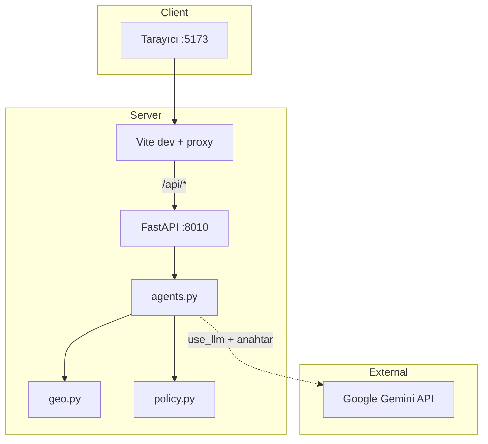

# İddia Stres Testi

Pazaryeri ve D2C satıcılarının **ürün listeleme metinlerini** (başlık + açıklama) risk, politika uyumu ve **bölgesel düzenleyici bağlam** açısından tarayan tam yığın (full-stack) web uygulaması.

Analiz sonucunda elde edersiniz:

- Tespit edilen riskler ve genel uyumluluk skoru  
- Önerilen başlık / açıklama ve değişiklik özeti  
- Denetçi kararı (onay / revizyon / red)  
- **Coğrafi uyumluluk (GEO) raporu** — seçtiğiniz ülkeler/bölgeler için ayrı skor ve yasa özeti  
- Kullanılan politika pasajları (demo veri seti)

### Coğrafi uyumluluk (GEO)

Projenin ayırt edici özelliği; hem mock hem Gemini modunda çalışır.

Savcı aşamasında bulunan her risk kodu (`UNSUB_HEALTH`, `UNSUB_GUARANTEE`, `UNSUB_SUPERLATIVE` vb.), sizin seçtiğiniz **hedef bölgelere** göre ilgili mevzuat kartlarına eşlenir. Backend’de `geo.py` içindeki `analyze_geo()` fonksiyonu bu eşlemeyi yapar; sonuçlar arayüzde **Coğrafi uyumluluk** panelinde gösterilir.

| Bölge kodu | Kapsam | Örnek referanslar (demo özet) |
|------------|--------|-------------------------------|
| **TR** | Türkiye | TKHK 6502, Ticari Reklam Yönetmeliği |
| **EU** | Avrupa Birliği | UCPD, Nutrition & Health Claims, Green Claims |
| **US** | Amerika Birleşik Devletleri | FTC Act, Green Guides, FDA etiketleme |

**Her bölge kartında:**

- Bölgeye özel **uyumluluk skoru** (0–100)  
- Risk özeti (düşük / orta / yüksek düzenleyici risk)  
- Tetiklenen risklere bağlı **ilgili yasa** listesi (madde notları ve kısa açıklamalar)  
- Uyum için **öneriler**

**Nasıl kullanılır?** Listeleme formunda **Hedef bölgeler** satırından TR, AB ve/veya ABD’yi seçin (birden fazla seçilebilir). Varsayılan: Türkiye + AB. Analiz bittikten sonra sonuç ekranında coğrafi kartlar yalnızca seçtiğiniz bölgeler için üretilir.

> GEO çıktıları **özet ve eğitim amaçlıdır**; resmi mevzuat veya avukatlık hizmeti yerine geçmez.

> **Uyarı:** Bu araç hukuki veya mali danışmanlık sunmaz. Sonuçlar ön inceleme ve demo amaçlıdır; yayın öncesi kararlarınızı mutlaka uzmanla doğrulayın.

**Depo:** [github.com/enginakts/e-ticaret](https://github.com/enginakts/e-ticaret)

---

## İçindekiler

1. [Coğrafi uyumluluk (GEO)](#coğrafi-uyumluluk-geo) *(giriş bölümünde)*  
2. [Gereksinimler](#gereksinimler)  
3. [Projeyi indirme](#projeyi-indirme)  
4. [Kurulum ve çalıştırma (adım adım)](#kurulum-ve-çalıştırma-adım-adım)  
5. [Uygulamayı kullanma](#uygulamayı-kullanma)  
6. [Çalışma modları: Mock ve Gemini](#çalışma-modları-mock-ve-gemini)  
7. [Ortam değişkenleri](#ortam-değişkenleri)  
8. [Proje yapısı](#proje-yapısı)  
9. [API (geliştiriciler için)](#api-geliştiriciler-için)  
10. [Sorun giderme](#sorun-giderme)  
11. [Üretim derlemesi (isteğe bağlı)](#üretim-derlemesi-isteğe-bağlı)  
12. [Bilinen sınırlar](#bilinen-sınırlar)

---

## Gereksinimler

Bilgisayarınızda aşağıdakiler kurulu olmalıdır:

| Yazılım | Minimum sürüm | Kontrol komutu |
|---------|-----------------|----------------|
| **Python** | 3.9 | `python --version` veya `py -3 --version` |
| **Node.js** | 18 LTS (20 önerilir) | `node --version` |
| **npm** | 9+ (Node ile gelir) | `npm --version` |
| **Git** | (depoyu klonlamak için) | `git --version` |

İnternet bağlantısı:

- `pip install` ve `npm install` için kurulum sırasında  
- Gemini ile analiz için API çağrıları sırasında  

Gemini kullanmayacaksanız yalnızca **kural tabanlı mock** mod için API anahtarı gerekmez; yine de backend ve frontend’i çalıştırmanız gerekir.

---

## Hızlı başlangıç

### Git ile klonlama (önerilen)

```powershell
git clone https://github.com/enginakts/e-ticaret.git
cd e-ticaret
```

### ZIP olarak indirme

GitHub sayfasında **Code → Download ZIP** ile indirip klasörü açın. Sonraki tüm komutlarda proje kök dizinine (`e-ticaret` veya açtığınız klasör adı) geçin.

---

## Kurulum ve çalıştırma (adım adım)

Uygulama **iki süreç** ister: **backend (API)** ve **frontend (arayüz)**. İkisini de açık tutmanız gerekir; arayüz API’ye Vite proxy üzerinden bağlanır.

```
┌─────────────────────┐     proxy /api      ┌─────────────────────┐
│  Frontend :5173     │ ──────────────────► │  Backend  :8010     │
│  (npm run dev)      │                       │  (uvicorn)          │
└─────────────────────┘                       └─────────────────────┘
         │                                              │
         ▼                                              ▼
   Tarayıcı: localhost:5173                    Swagger: :8010/docs
```

### Adım 1 — Backend sanal ortamı ve bağımlılıklar

**Windows (PowerShell):**

```powershell
cd backend
python -m venv .venv
.\.venv\Scripts\Activate.ps1
python -m pip install --upgrade pip
pip install -r requirements.txt
```

`python` tanınmıyorsa:

```powershell
py -3 -m venv .venv
.\.venv\Scripts\Activate.ps1
py -3 -m pip install -r requirements.txt
```

**macOS / Linux:**

```bash
cd backend
python3 -m venv .venv
source .venv/bin/activate
pip install --upgrade pip
pip install -r requirements.txt
```

Sanal ortam aktifken komut satırında `(.venv)` öneki görünür.

### Adım 2 — Backend API’yi başlatma

Hâlâ `backend` klasöründe ve sanal ortam açıkken:

```powershell
python -m uvicorn app.main:app --reload --host 127.0.0.1 --port 8010
```

Başarılı çıktı örneği:

```text
INFO:     Uvicorn running on http://127.0.0.1:8010
```

Bu terminali **kapatmayın**; API burada çalışmaya devam eder.

Kontrol: tarayıcıda [http://127.0.0.1:8010/api/health](http://127.0.0.1:8010/api/health) açın — `{"status":"ok"}` dönmeli.

### Adım 3 — Frontend bağımlılıkları

**Yeni bir terminal** açın (backend çalışır durumda kalsın):

```powershell
cd frontend
npm install
```

İlk kurulum birkaç dakika sürebilir.

### Adım 4 — Frontend geliştirme sunucusu

```powershell
npm run dev
```

Başarılı çıktı örneği:

```text
➜  Local:   http://localhost:5173/
```

Tarayıcıda [http://localhost:5173](http://localhost:5173) adresini açın.

### Adım 5 — Proxy ayarı (genelde hazır)

`frontend/.env.development` dosyası varsayılan olarak backend’i işaret eder:

```env
VITE_API_PROXY_TARGET=http://127.0.0.1:8010
```

Backend’i farklı bir portta çalıştırırsanız bu satırı güncelleyin ve `npm run dev` komutunu yeniden çalıştırın.

### Özet: Her kullanımda

| Terminal | Klasör | Komut |
|----------|--------|--------|
| 1 | `backend` | `.\.venv\Scripts\Activate.ps1` → `python -m uvicorn app.main:app --reload --host 127.0.0.1 --port 8010` |
| 2 | `frontend` | `npm run dev` |

Durdurmak için her iki terminalde `Ctrl+C`.

---

## Uygulamayı kullanma

### 1. Arayüzü açın

[http://localhost:5173](http://localhost:5173)

### 2. Listeleme metnini girin

- **Ürün başlığı** ve **açıklama** (zorunlu)  
- İsteğe bağlı: malzeme / ürün gerçekleri (ör. `ABS plastik gövde`)  
- **Pazaryeri profili** ve **hedef bölgeler** (TR, AB, ABD — çoklu seçim)

Örnek metin formda önceden doldurulmuş gelebilir; kendi metninizle değiştirebilirsiniz.

### 3. Gemini API (isteğe bağlı)

Üst menüden **Gemini API**:

1. [Google AI Studio](https://aistudio.google.com/apikey) üzerinden ücretsiz API anahtarı oluşturun.  
2. Anahtarı **Gemini API anahtarı** alanına yapıştırın (`AIza...`).  
3. Model seçin (varsayılan: `gemini-1.5-flash`).  
4. **Gemini ile yapay zekâ analizi** kutusu işaretli kalsın.

Anahtar tarayıcınızda saklanır; sayfayı yenilediğinizde tekrar yüklenir. Bağlantı adresi otomatik ayarlanır, elle girmeniz gerekmez.

### 4. Analizi başlatın

**Analizi başlat** düğmesine tıklayın. Birkaç saniye ile ~30 saniye arası sürebilir (mod ve metin uzunluğuna göre).

### 5. Sonuçları inceleyin

| Panel | İçerik |
|-------|--------|
| **Risk analizi** | Uyumluluk skoru, risk listesi, insan incelemesi uyarısı |
| **İşlem adımları** | Kural tarama, savcı, düzeltici, denetçi, coğrafi analiz süreleri |
| **Denetçi özeti** | Onaylandı / revizyon gerekli / reddedildi |
| **Coğrafi uyumluluk** | Bölge bazlı skor ve yasa özetleri |
| **Metin karşılaştırması** | Orijinal ve önerilen başlık-açıklama |
| **Politika pasajları** | Analizde kullanılan demo politika metinleri |

Rozetler:

- **Model** — Gemini ile analiz yapıldı  
- **Kurallar** — API anahtarı yok veya LLM kapalı; kural tabanlı mock kullanıldı  

LLM hata verirse sonuç yine gelir; sarı uyarı bandında `error_message` gösterilebilir.

---

## Çalışma modları: Mock ve Gemini

| Durum | Ne olur? |
|-------|----------|
| API anahtarı yok, “Gemini ile analiz” açık | **Kural tabanlı mock** — regex ile risk ve basit metin düzeltmesi |
| API anahtarı var, “Gemini ile analiz” açık | **Gemini** — savcı, düzeltici ve denetçi için üç model çağrısı |
| “Gemini ile analiz” kapalı | Her zaman **mock**, anahtar olsa bile |

Mock mod demo ve hızlı test içindir. Gerçekçi metin önerisi ve denetçi yorumu için Gemini anahtarı gerekir.

Anahtarı iki şekilde verebilirsiniz (öncelik sırası):

1. Arayüzden (istek gövdesiyle sunucuya gider, sunucuda dosyaya yazılmaz)  
2. `backend/.env` içinde `GEMINI_API_KEY=...` (sunucu tarafı varsayılan)

---

## Ortam değişkenleri

Proje kökündeki `.env.example` dosyasını kopyalayarak `backend/.env` oluşturabilirsiniz:

```powershell
cd backend
copy ..\.env.example .env
```

| Değişken | Zorunlu | Açıklama |
|----------|---------|----------|
| `GEMINI_API_KEY` | Hayır | Sunucuda varsayılan Gemini anahtarı |
| `GEMINI_MODEL` | Hayır | Varsayılan: `gemini-1.5-flash` |

İstek içindeki `gemini_api_key`, `.env` değerinden **önceliklidir**.

`.env` dosyasını git’e eklemeyin (`.gitignore` içinde).

---

## Proje yapısı

```
e-ticaret/
├── backend/
│   ├── app/
│   │   ├── main.py           # FastAPI: /api/health, /api/stress-test
│   │   ├── agents.py         # Mock pipeline + Gemini (savcı/düzeltici/denetçi)
│   │   ├── geo.py            # TR / EU / US düzenleyici özetleri
│   │   ├── policy.py         # Politika metninden snippet seçimi
│   │   ├── schemas.py        # Pydantic istek/yanıt şemaları
│   │   └── config.py         # Ortam ayarları
│   ├── data/
│   │   └── synthetic_policy.md   # Demo politika (gerçek platform metni değil)
│   ├── requirements.txt
│   └── .env                  # Siz oluşturursunuz (git’te yok)
├── frontend/
│   ├── src/
│   │   ├── App.tsx           # Ana arayüz
│   │   ├── apiSettings.ts    # Gemini anahtarı — localStorage
│   │   ├── icons.tsx         # SVG ikonlar
│   │   └── types/api.ts      # TypeScript tipleri
│   ├── .env.development      # Vite proxy hedefi (8010)
│   ├── package.json
│   └── vite.config.ts
├── .env.example
├── .gitignore
├── code_review.md            # Teknik inceleme notları
└── README.md
```

---

## API (geliştiriciler için)

İnteraktif dokümantasyon: [http://127.0.0.1:8010/docs](http://127.0.0.1:8010/docs)

| Yöntem | Yol | Açıklama |
|--------|-----|----------|
| GET | `/api/health` | Sağlık kontrolü |
| POST | `/api/stress-test` | Tam analiz |
| GET | `/api/policy-preview?q=...` | Politika önizleme |

**Örnek `curl` (mock — anahtar gerekmez):**

```powershell
curl -X POST http://127.0.0.1:8010/api/stress-test `
  -H "Content-Type: application/json" `
  -d "{\"title\":\"Test ürün\",\"description\":\"Örnek açıklama metni.\",\"use_llm\":false,\"target_regions\":[\"TR\"]}"
```

**Örnek gövde (Gemini):**

```json
{
  "title": "Ürün başlığı",
  "description": "Ürün açıklaması",
  "use_llm": true,
  "gemini_api_key": "AIza...",
  "gemini_model": "gemini-1.5-flash",
  "target_regions": ["TR", "EU"],
  "product_facts": { "materials": "ABS plastik" }
}
```

---

## Sorun giderme

### `python` veya `py` bulunamıyor

- [python.org](https://www.python.org/downloads/) üzerinden kurun; kurulumda **“Add Python to PATH”** işaretleyin.  
- Veya Anaconda kullanın: `conda activate` sonrası `python -m pip install -r requirements.txt`.

### `npm` bulunamıyor

- [nodejs.org](https://nodejs.org/) LTS sürümünü kurun. Terminali yeniden açın.

### Arayüz açılıyor ama analiz hata veriyor / boş kalıyor

1. Backend’in çalıştığını doğrulayın: [http://127.0.0.1:8010/api/health](http://127.0.0.1:8010/api/health)  
2. `frontend/.env.development` içinde port **8010** olmalı.  
3. Backend terminalinde kırmızı hata var mı bakın.  
4. Tarayıcı geliştirici araçları → **Network** → `stress-test` isteğinin durum kodu (200 olmalı).

### Her zaman “Kurallar” rozeti, Gemini kullanmıyor

- Arayüzde API anahtarı girildi mi?  
- “Gemini ile yapay zekâ analizi” işaretli mi?  
- Anahtar geçersizse backend mock’a düşer; sarı `error_message` bandına bakın.

### Port 8010 veya 5173 kullanımda

Başka uygulama portu kaplıyorsa:

- Backend için: `--port 8012` gibi farklı port verin ve `VITE_API_PROXY_TARGET` değerini buna göre güncelleyin.  
- Frontend için: Vite başka port önerebilir; terminal çıktısındaki `Local:` adresini kullanın (proxy’nin backend’e gitmesi için `.env.development` şart).

### PowerShell script çalıştırma engeli (`Activate.ps1`)

```powershell
Set-ExecutionPolicy -Scope CurrentUser RemoteSigned
```

Sonra tekrar `.\.venv\Scripts\Activate.ps1` deneyin.

### `pip install` hata veriyor

Sanal ortamın aktif olduğundan emin olun. Alternatif:

```powershell
python -m pip install -r requirements.txt
```

---

## Üretim derlemesi (isteğe bağlı)

Statik frontend derlemesi:

```powershell
cd frontend
npm run build
```

Çıktı: `frontend/dist/`. Backend’i ayrı sunucuda çalıştırıp `dist` klasörünü nginx veya benzeri ile servis edebilirsiniz; API istekleri production ortamında doğru backend URL’sine yönlendirilmelidir (Vite proxy yalnızca geliştirmede vardır).

---

## Mimari (özet)



Akış: kural tarama → savcı → düzeltici → denetçi → coğrafi analiz → JSON yanıt.

---

## Bilinen sınırlar

- `marketplace_profile` arayüzde seçilebilir; backend’de profile özel kurallar henüz yok.  
- Politika eşleştirme basit anahtar kelime tabanlıdır (vektör veritabanı değil).  
- Otomatik test (pytest vb.) paketi yoktur.  
- `synthetic_policy.md` ve coğrafi yasa kartları **demo** içindir; resmi mevzuat değildir.  

Teknik detaylar: [code_review.md](code_review.md).

---

## Katkı ve lisans

Bu depo eğitim / hackathon ve demo amaçlı geliştirilmiştir. Sorun veya öneri için GitHub Issues kullanılabilir.

---

*Sürüm 14.3 — İddia Stres Testi*
