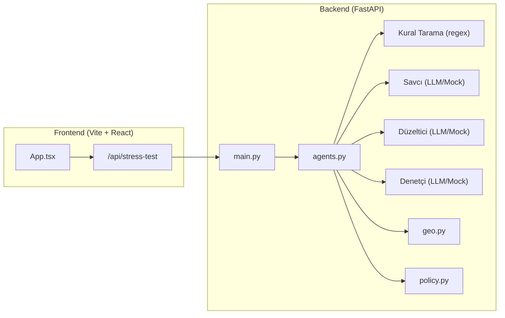
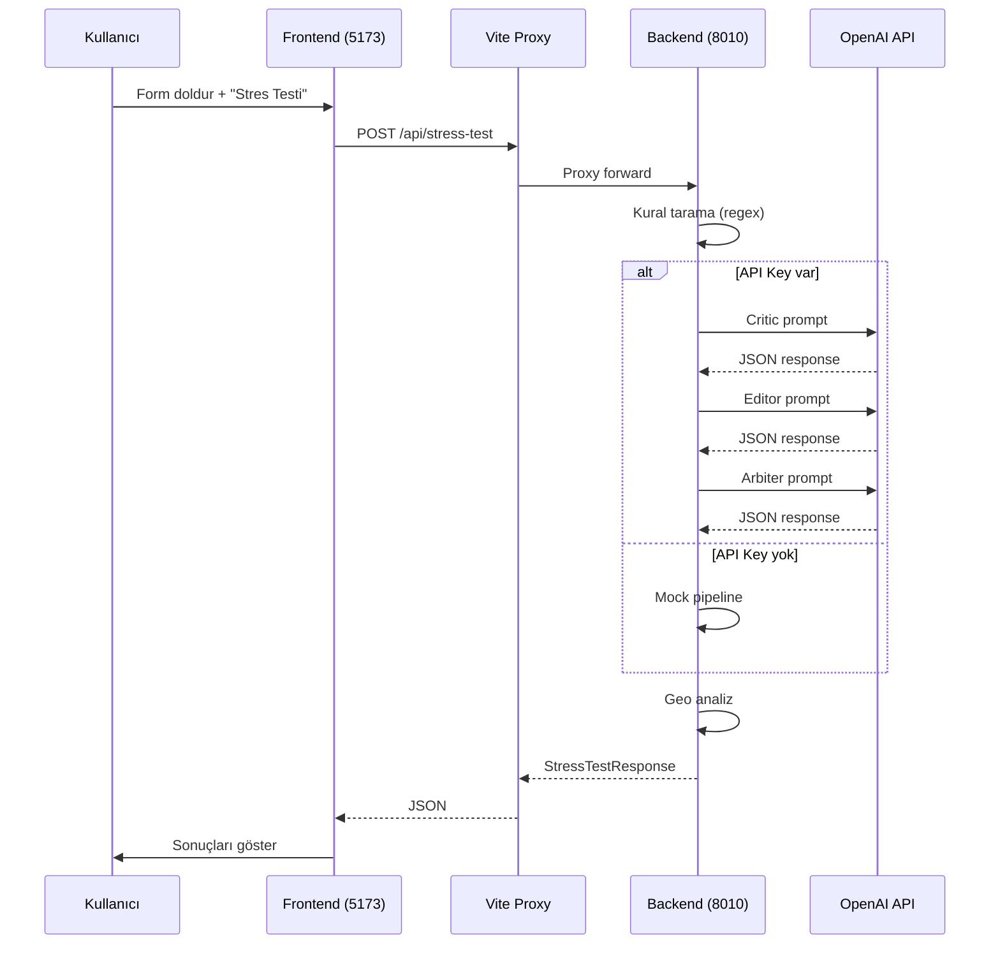

# 🔍 İddia Stres Testi — Detaylı Kod İnceleme Raporu

## 📁 Proje Genel Bakış

**Amaç:** Pazaryeri / D2C ürün listeleme metinlerini çok ajanlı AI pipeline ile risk ve uyumluluk açısından analiz eden bir sistem.

| Katman | Teknoloji | Dosya Sayısı |
|--------|-----------|-------------|
| Backend | FastAPI + Pydantic + OpenAI SDK | 7 modül |
| Frontend | Vite + React + TypeScript | 6 dosya |
| Data | Sentetik politika dokümanı | 1 dosya |

---

## 🏗️ Mimari Diyagram



---

## ✅ Güçlü Yönler

### Backend
1. **Hibrit mimari** — Kural motoru (regex) + LLM ikili yapısı; API anahtarı yoksa otomatik mock fallback
2. **Tip güvenliği** — Pydantic v2 ile tam şema doğrulaması, `Literal` tipler ile kısıtlı değerler
3. **3 ajanlı pipeline** — Savcı → Düzeltici → Denetçi zinciri iyi tasarlanmış
4. **Coğrafi uyumluluk** — TR/EU/US için gerçek yasa referansları ile zengin veri tabanı
5. **Token takibi** — LLM modunda maliyet hesaplaması
6. **Graceful degradation** — LLM hatası durumunda `mock_pipeline`'a düşüş ([agents.py:406-409](file:///c:/Users/engin/Desktop/folders/btk_projects/backend/app/agents.py#L406-L409))

### Frontend
1. **Premium dark-mode UI** — Glassmorphism, gradient'ler, micro-animasyonlar
2. **Tam tip uyumu** — Backend şemalarıyla birebir eşleşen TypeScript interface'leri
3. **API ayarları kalıcılığı** — localStorage ile legacy migration desteği
4. **SVG Gauge** — Uyumluluk skoru için animasyonlu halka grafik
5. **Responsive tasarım** — 2 sütun grid → mobilde tek sütun

---

## ⚠️ Sorunlar ve İyileştirme Önerileri

### 🔴 Kritik Sorunlar

| # | Dosya | Satır | Sorun | Öneri |
|---|-------|-------|-------|-------|
| 1 | [agents.py](file:///c:/Users/engin/Desktop/folders/btk_projects/backend/app/agents.py#L406-L409) | 406-409 | `except Exception` çok geniş — LLM hatalarını sessizce yutuyor, hata loglanmıyor | `logging.exception()` ekle, hata türünü response'a yansıt |
| 2 | [agents.py](file:///c:/Users/engin/Desktop/folders/btk_projects/backend/app/agents.py#L311-L312) | 311-312 | Critic JSON parse hatası `ValueError("critic_json_invalid")` fırlatıyor ama `main.py`'de yakalanmıyor → 500 Internal Server Error | FastAPI exception handler ekle veya try/except ile sarma |
| 3 | [App.tsx](file:///c:/Users/engin/Desktop/folders/btk_projects/frontend/src/App.tsx#L125) | 125 | `loadApiSettings()` her render'da çağrılıyor (fonksiyon dışında state init) — `useState(() => loadApiSettings())` olmalı | Lazy initializer kullan |
| 4 | [main.py](file:///c:/Users/engin/Desktop/folders/btk_projects/backend/app/main.py#L14) | 14-15 | README port 8000 diyor, run script'ler 8010 kullanıyor — tutarsızlık | README'yi güncelle |

### 🟡 Orta Öncelikli

| # | Dosya | Sorun | Öneri |
|---|-------|-------|-------|
| 5 | [policy.py](file:///c:/Users/engin/Desktop/folders/btk_projects/backend/app/policy.py#L22-L37) | RAG basit keyword örtüşmesi — TF-IDF bile değil | En azından TF-IDF skorlama veya embedding tabanlı retrieval |
| 6 | [agents.py](file:///c:/Users/engin/Desktop/folders/btk_projects/backend/app/agents.py#L170-L180) | Mock editor'deki regex replace'ler sıralama bağımlı — `garanti` paterni `garantili` yerine de çalışabilir | Uzun pattern'leri önce işle veya word boundary'leri düzelt |
| 7 | [App.tsx](file:///c:/Users/engin/Desktop/folders/btk_projects/frontend/src/App.tsx#L145-L149) | `useEffect` her API ayarı değişiminde localStorage'a yazıyor — debounce yok | `useDeferredValue` veya debounce ekle |
| 8 | [geo.py](file:///c:/Users/engin/Desktop/folders/btk_projects/backend/app/geo.py#L238) | `set[str]` tipi Python 3.9'da `builtins.set` subscript desteklemiyor | `Set[str]` (typing) kullan veya `from __future__ import annotations` zaten var, sorun yok ama dikkat |
| 9 | [schemas.py](file:///c:/Users/engin/Desktop/folders/btk_projects/backend/app/schemas.py#L24-L27) | `marketplace_profile` kullanılıyor ama backend'de hiçbir yerde profile'a göre farklı davranış yok | Profile bazlı kural seti ekle veya alanı kaldır |
| 10 | [main.py](file:///c:/Users/engin/Desktop/folders/btk_projects/backend/app/main.py#L30-L36) | CORS sadece localhost:5173 — production deploy'da sorun olacak | Env'den dinamik origin okuma ekle |

### 🟢 Düşük Öncelikli / İyileştirme

| # | Konu | Detay |
|---|------|-------|
| 11 | **Loglama yok** | Backend'de hiç `logging` modülü kullanılmıyor — debug çok zor |
| 12 | **Test yok** | Hiç unit test / integration test dosyası yok |
| 13 | **Rate limiting** | API'de rate limit yok — kötüye kullanıma açık |
| 14 | **index.css font duplicate** | `index.html` ve `index.css` ikisi de Google Fonts yüklüyor — biri gereksiz |
| 15 | **Arbiter LLM fallback** | [agents.py:374](file:///c:/Users/engin/Desktop/folders/btk_projects/backend/app/agents.py#L374) — Arbiter parse hatası sessizce mock'a düşüyor, kullanıcı bilgilendirilmiyor |
| 16 | **Policy cache** | `_POLICY_CACHE` global mutable — thread safety sorunu olabilir (uvicorn workers > 1) |

---

## 📊 Dosya Bazlı Detaylı Analiz

### `agents.py` (410 satır) — Ana iş mantığı

**Yapı:**
- `_RULES` → 6 regex pattern (sağlık, garanti, üstünlük, çevre, aciliyet, indirim)
- `run_rule_scan()` → Kural tabanlı risk tarama
- `_facts_conflict_scan()` → Ürün gerçekleri ile metin çelişki kontrolü
- `mock_pipeline()` → API anahtarı yokken çalışan tam pipeline
- `llm_pipeline()` → OpenAI SDK ile 3 ardışık LLM çağrısı
- `run_stress_test()` → Giriş noktası (LLM vs mock karar verici)

**Token maliyet hesabı:**
```python
# agents.py:384 — Hardcoded fiyat, model değişirse güncellenmeli
token_usage.estimated_cost_usd = round(token_usage.total_tokens * 0.00015 / 1000, 4)
```
> [!WARNING]
> Bu fiyat gpt-4o-mini'ye özel. Farklı model kullanılırsa yanlış maliyet gösterecek.

### `geo.py` (274 satır) — Coğrafi düzenleme analizi

**Kapsam:** 3 bölge (TR, EU, US) × 7 risk kodu = toplam ~40 yasa referansı

**Uyumluluk skoru hesabı:**
```
compliance = 100 - Σ(risk_severity_weight)
  high=30, medium=15, low=5
```

> [!NOTE]
> Skor hesaplaması `geo.py` ve `agents.py`'de farklı ağırlıklarla yapılıyor:
> - `geo.py:222` → high:30, medium:15, low:5
> - `agents.py:98` → high:18, medium:10, low:4
> 
> Bu kasıtlı mı yoksa tutarsızlık mı belirsiz.

### `schemas.py` (114 satır) — Veri modelleri

Pydantic v2 modelleri, iyi yapılandırılmış. Frontend TypeScript interface'leriyle **birebir uyumlu** ✅

### `policy.py` (38 satır) — Politika retrieval

Basit keyword örtüşmesi ile chunk seçimi. Global cache ile dosya bir kez okunuyor.

### `App.tsx` (495 satır) — Ana UI bileşeni

**Bileşenler:** `Gauge`, `PipelineTracker`, `RiskCard`, `GeoCard` + ana `App`

> [!TIP]
> 495 satır tek dosyada — bileşenleri ayrı dosyalara çıkarmak bakımı kolaylaştırır.

### `apiSettings.ts` (124 satır) — localStorage yönetimi

Legacy key migration'ı ile geriye dönük uyumluluk sağlanmış — iyi tasarım ✅

---

## 🔄 Backend ↔ Frontend Veri Akışı



---

## 📋 Öncelikli Aksiyon Listesi

1. **Hata yönetimi** — `agents.py`'de logging ekle, exception handler'lar kur
2. **Port tutarsızlığı** — README'yi 8010 olarak güncelle
3. **Skor tutarsızlığı** — `geo.py` ve `agents.py` ağırlıklarını hizala veya belge
4. **`marketplace_profile` kullanımı** — Ya profile bazlı kurallar ekle ya da kaldır
5. **Font duplicate** — `index.html` veya `index.css`'den birini kaldır
6. **Temel testler** — En azından `run_rule_scan()` ve `analyze_geo()` için unit test
7. **Bileşen ayrımı** — `App.tsx`'i küçük bileşenlere böl
